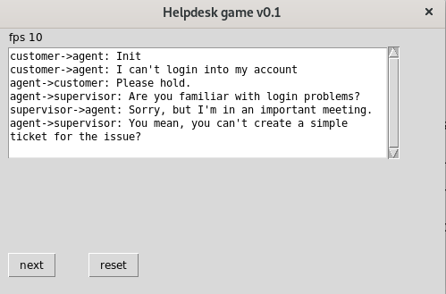

# Helpdesk-game
Interactive Helpdesk simulator with provides a dialogue tree with three conflicting social roles

The game doesn't need to be installed, it's enough to copy the python script into a working directory and execute it with “python3 helpdeskgame.py”. The user has two buttons on the screen. With the next button he moves the pointer in the dialogue tree one position forward, while the reset button brings the simulation into the init state.

The dialogue tree describes the relationship between three different social roles in a helpdesk: customer, first level agent and supervisor. It's up to the first level agent, to decide what to do next. He can argue only with the customer in a 1:1 dialogue, or he can deescalate the problem to the supervisor. The game doesn't provide a score which kind of pathway is the right one, instead different options are presented to show in which direction the arguing will go.

Right now, the dialogue tree consists only of two customer problems: A broken monitor and a problem during login into a user account. It's only a minimal software because the user has no radio buttons to select the next action by himself. Also the datastructure which holds the dialogue is a very easy one.

