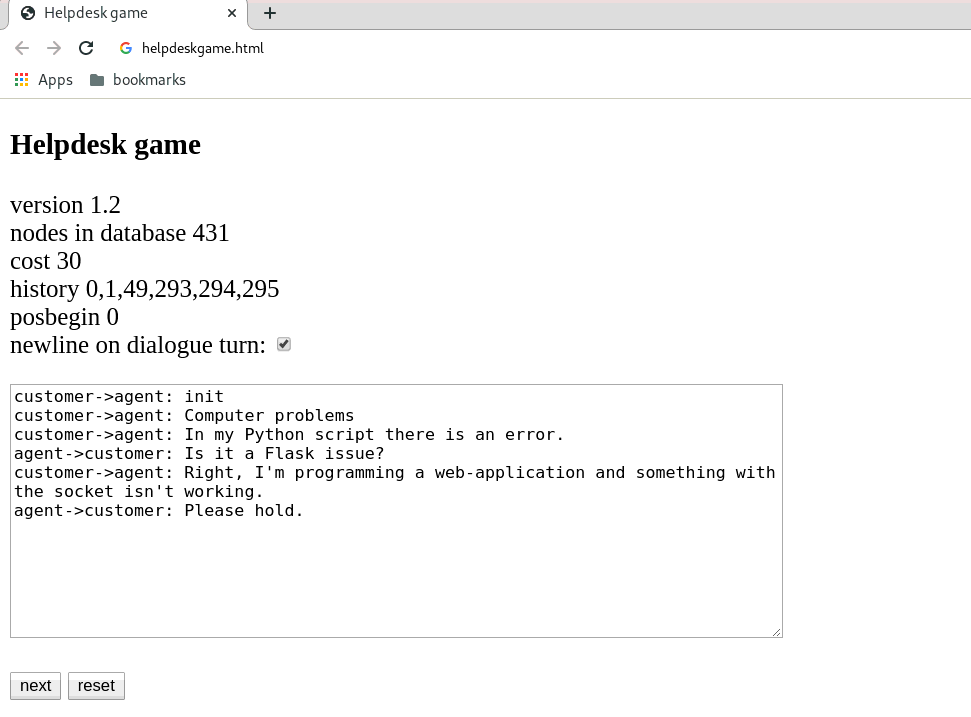

# Helpdesk-game
Interactive Helpdesk simulator provides a dialogue tree with three conflicting social roles

The game doesn't need to be installed, it's enough to copy the python script into a working directory and execute it with “python3 helpdeskgame.py”. The user has two buttons on the screen. With the next button he moves the pointer in the dialogue tree one position forward, while the reset button brings the simulation into the init state.

The dialogue tree describes the relationship between three different social roles in a helpdesk: customer, first level agent and supervisor. It's up to the first level agent, to decide what to do next. He can argue only with the customer in a 1:1 dialogue, or he can deescalate the problem to the supervisor. The game provides a score for each pathway. A speech with the supervisor is more expensive, than a speech with the customer.

Right now, the dialogue tree consists of four customer problems: broken monitor, problems during login, error in a python script and server downtime. It's only a minimal software because the user has no radio buttons to select the next action by himself. Also the datastructure which holds the dialogue is a very easy one.

### Changelog
version 0.4

 - initializing of string list was simplified
 - increased amount of dialogue speech to 110
 
 version 0.3

- increased amount of dialogue speech, now there are 92 entries in the database
- small layout fix
 
version 0.24

- the amount of dialogue speech has increased to 74
- cost function which is different for agent and supervisor speech

